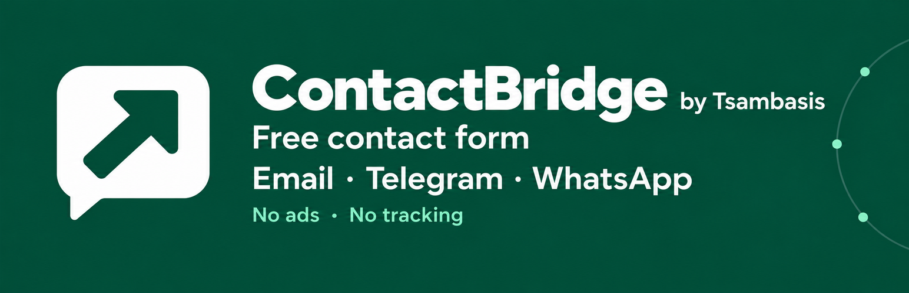

# Kontelio - Contact Forms with Telegram, WhatsApp and Email



A free WordPress contact-form plugin with email, Telegram and WhatsApp delivery, a visual field builder, and an optional encrypted inquiry inbox. The menu and everyday product name are **Kontelio**.

Developed by [Tsambasis & Tsambasis](https://tsambasis.net/). WordPress.org contributor account: `solutionfirst`. No advertising, paid feature tiers or developer tracking.

## Review status

Version **1.0.0** is an unpublished review build. The existing WordPress.org submission is currently assigned `contactbridge`. We are requesting **`kontelio`** in the same review email thread; this change and publication still require reviewer confirmation. The [GitHub repository](https://github.com/tsambasis-tsambasis/kontelio) name does not confirm WordPress.org approval.

## Features

- Insert a responsive form with `[kontelio]`.
- Combine email, Telegram and the official WhatsApp Cloud API.
- Use the site's WordPress mail setup or optional authenticated SMTP for this plugin.
- Configure 1–20 fields: text, email, telephone, message, selection and checkbox.
- Choose presets, light/dark/automatic themes, rounded/square fields, or an embedded layout with a live preview.
- Enable content-free notifications and an encrypted local inquiry inbox separately for each channel.
- Keep saved custom text and existing language choices. New installations follow WordPress's language; English is the source and fallback.

## Install and configure

Requires WordPress **6.6+**, PHP **7.4+**, and OpenSSL for encrypted inbox storage and encrypted SMTP passwords.

1. Download the prepared **[kontelio-1.0.0.zip](https://github.com/tsambasis-tsambasis/kontelio/raw/refs/heads/main/dist/kontelio-1.0.0.zip)** installation package. GitHub's automatically generated source archives also contain development/repository material and are not the prepared plugin package.
2. In WordPress, open **Plugins → Add New → Upload Plugin**, upload the package and activate it. If an earlier development build exists, follow [UPGRADING.md](docs/UPGRADING.md) first.
3. Open **Settings → Kontelio**.
4. Configure at least one delivery channel, save, then send a connection test to the intended recipient.
5. Add a Shortcode block:

   ```text
   [kontelio]
   ```

   Optional appearance overrides:

   ```text
   [kontelio theme="dark" shape="square" heading="Contact us"]
   [kontelio embedded="true"]
   ```

6. Check the published form on desktop and mobile and adapt your privacy notice to your actual configuration.

Existing `[contact_bridge]` shortcodes remain supported for earlier installations. Use `[kontelio]` for new pages.

## Delivery channels

| Channel | What you need |
| --- | --- |
| Email | Recipient address and working WordPress mail, or your SMTP host, sender address and credentials. SMTP supports a password or app password; OAuth-only providers need a suitable existing WordPress mail integration. |
| Telegram | A bot token and destination chat ID. The settings can confirm a private chat using a temporary pairing code. |
| WhatsApp | Business Platform Cloud API access, a phone-number ID, authorized token, recipient and approved message template. A personal WhatsApp account alone is insufficient. |

WhatsApp full-content notifications use five body parameters; extended-privacy notifications use a separate approved template with two. The settings explain the required order. Hosting, email services and Meta may charge. Signal is not included.

Connection tests send messages to configured recipients; the design preview does not send messages. API or mail-server acceptance does not guarantee delivery or reading.

## Privacy and retention

Extended privacy is optional per channel. Such a channel receives only a generic notice, site name and protected administrator link. Submitted details are encrypted in the local WordPress database and require an authorized administrator login to read. Channels with extended privacy disabled still receive full content.

The default retention is **30 days**. Choose another supported whole-day period or **0** for permanent storage until deletion. A changed setting affects new inquiries only. Expired records are hidden and cleaned through scheduled tasks; backups have their own retention. Successful local storage counts as receipt even if notifications fail; there is no automatic notification retry queue.

WordPress security keys are required to decrypt saved data. Keep them and database backups secure. WordPress personal-data export and erasure are supported. Uninstall permanently removes local inquiries regardless of the option to retain settings. See [readme.txt](readme.txt) for exact data flows, provider endpoints, limits and cleanup behavior.

Kontelio is independent software, not affiliated with Telegram, WhatsApp or Meta. The plugin does not by itself guarantee GDPR/DSGVO compliance.

## Translations and help

English is built into the source. The complete German translation is distributed separately under `translations/` and as a language-pack ZIP; the plugin installation ZIP does not contain translation catalogs. WordPress.org translation import/approval and automatic pack publication still need to happen. Until then, install the German pack manually as explained in [TRANSLATIONS.md](docs/TRANSLATIONS.md).

- [German quick-start guide](docs/ANLEITUNG.md)
- [Upgrade and earlier-build instructions](docs/UPGRADING.md)
- [Website and contact](https://tsambasis.net/)
- License: [GPLv2 or later](LICENSE)
